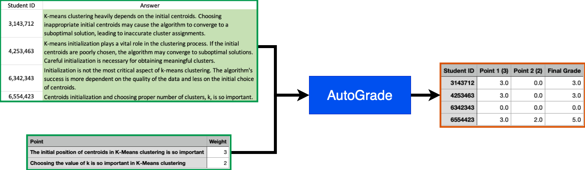

#  AutoGrade



## 1. Introduction
This tool is designed to be a simple, easy to use, and easy to extend autograder for assignments or exams. It is designed to help TAs and instructors grade assignments and exams. It is not designed to be a replacement for a human grader, but rather to help the grader by automating the tedious parts of grading. 

I've used flan-t5-large, a famous and open-source Large Language Model (LLM), to grade the assignments. The model is trained on a large dataset of English text, and it can be used to generate text, answer questions, and summarize text. I've used the model to grade the documents.

Several prompts, based on the training procedure of flan-t5, is used to grade each part of an answer. The model is being used in a zero-shot setting. The model is not fine-tuned on the dataset, and it is used as it is. I've tested this script on several manually graded answers, and it did a great job. However, it is not perfect, and it can make mistakes. Therefore, I recommend that you check the answers manually before submitting the grades.

## 2. Installation
### 2.1. Requirements
- Python 3.10 or higher

### 2.2. Install the requirements
```bash
pip install -r requirements.txt
```
You can also use the docker image to run the script. It's much easier this way. Just use the following command to run the script:
```bash
./docker.sh
```

## 3. Usage
### 3.1. Prepare the data
2 files are required to run the script:
- `answers.xlsx`: This file contains the answers of the students. The first column should contain the student ID, and the second column should contain the answer. For an example, look at the `answers.xlsx` in this repository.

- `grading.csv`: Each line of this file has two parts. The first part is a point that an ideal answer should have, and the second part is the grade associated with that point. For an example, look at the `grading.csv` in this repository.

### 3.2. Run the script
There are two ways to use AutoGrade:
1. Using the command line interface (CLI)
This is the recommended way to use AutoGrade. You can use the following command to run the script:
```bash
python main.py -a answers.xlsx -grading grading.csv
```

2. Using AutoGrade as a library
You can also use AutoGrade as a library. You can use the following code to run the script:
```python
    from mh_grader import MHGrader

    grader = MHGrader()
    points = [
        'The initial position of centroids in K-Means clustering is so important',
        'Choosing the value of k is so important in K-Means clustering',
    ]

    answer = "K-means clustering heavily depends on the initial centroids. Choosing inappropriate initial centroids may cause the algorithm to converge to a suboptimal solution, leading to inaccurate cluster assignments."

    grade, detail = grader.grade(answer, points, weights=[3, 2], verbose=False)

    print(f'Answer: {answer}')
    print('-'*50)
    for i, (g, w) in enumerate(detail):
        print(f'Point {i+1}: {g} out of {w}')
    print('-'*50)
    print(f'Final Grade: {grade}')
```

## 4. Future Work
- [ ] Add more prompts to the model to improve the accuracy of the grading.
- [ ] Add more features to the CLI.
- [ ] Develope a user interface (UI) for AutoGrade.

Since this is an open-source project, I would be happy to receive your contributions. If you have any suggestions, please let me know. You can also open an issue if you have any questions or problems. For now, I'm not planning to add more features to this project, but I would be happy to review your pull requests.


